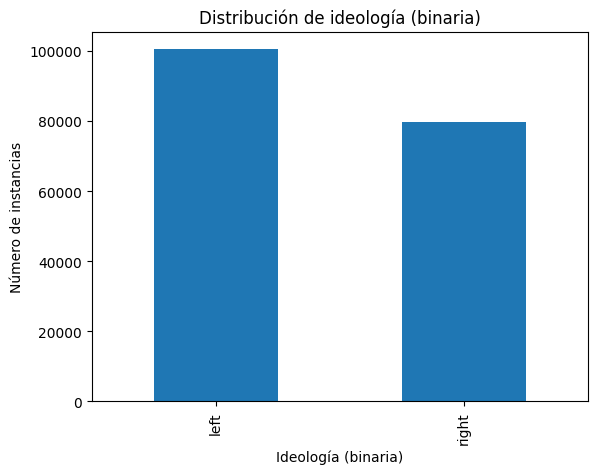
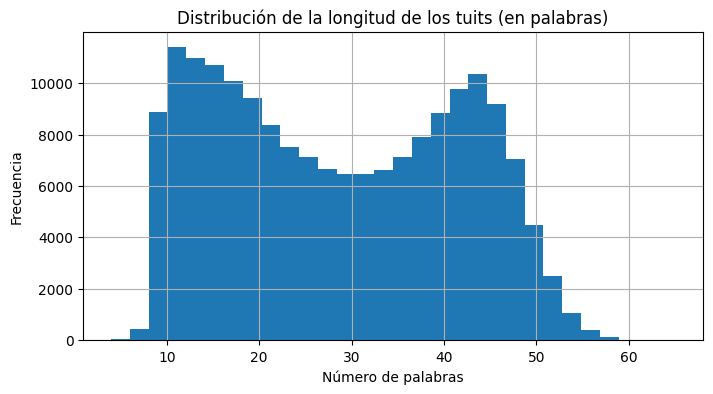
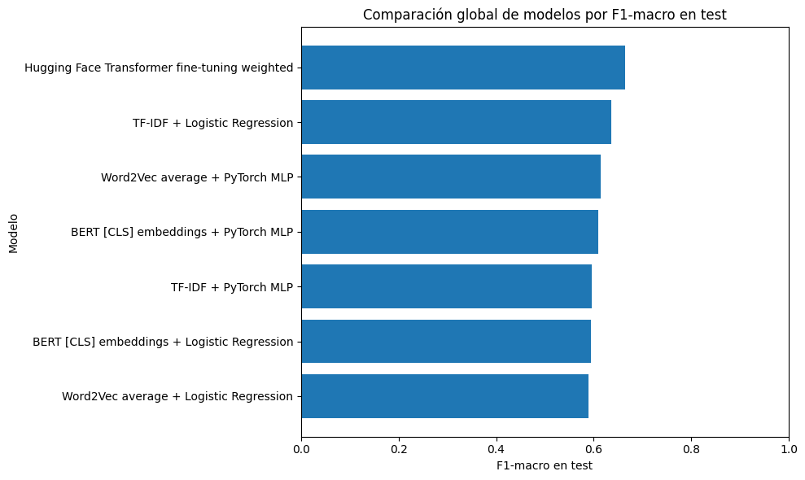
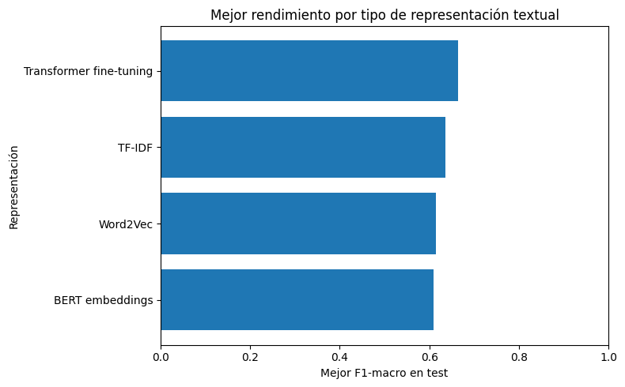
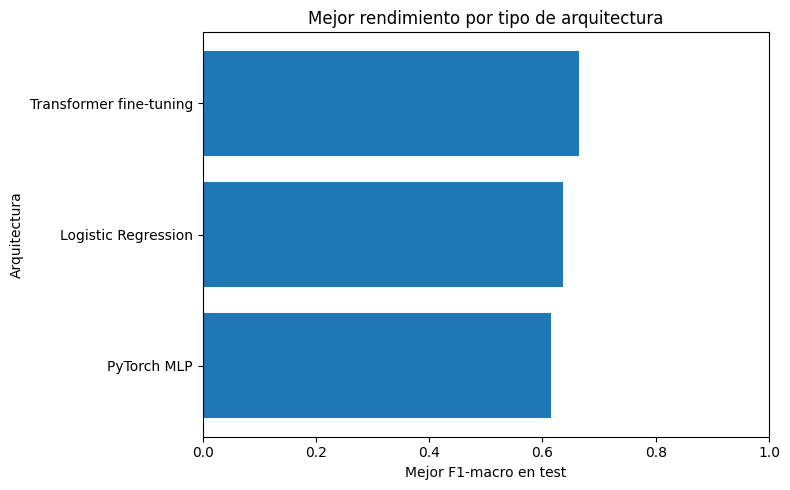
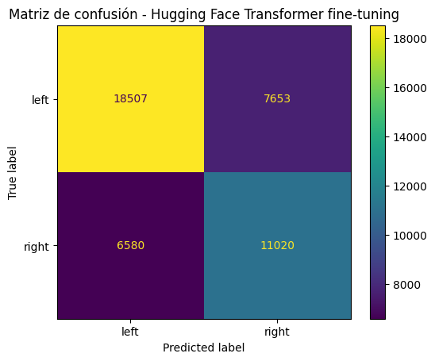
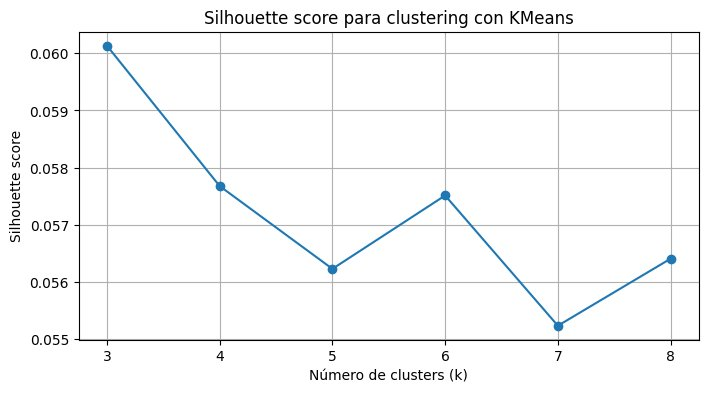
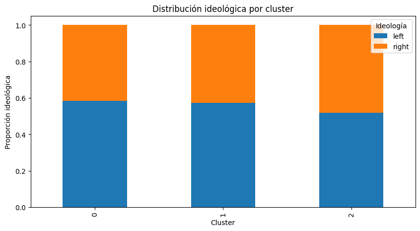
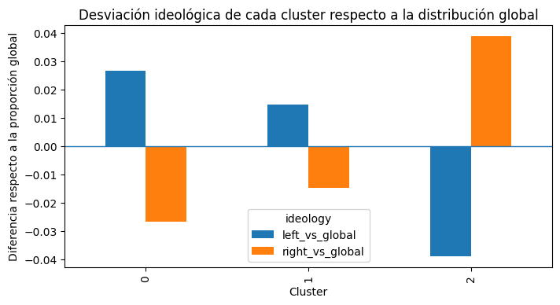
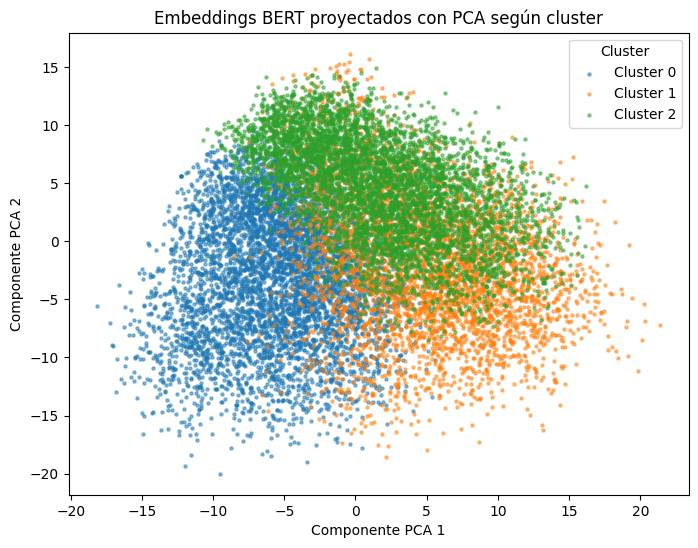

# Análisis de polarización ideológica en tweets políticos en español

Este proyecto analiza tweets políticos en español con técnicas de Procesamiento del Lenguaje Natural (NLP) y aprendizaje automático. El objetivo principal es predecir la ideología binaria de cada tweet (`left` / `right`) a partir de su texto.

Además del proyecto base, se incluye una extensión no supervisada basada en clustering sobre embeddings BERT. Esta extensión se utiliza para explorar si existen agrupamientos discursivos relacionados con la ideología política.

## 1. Resumen del proyecto

El trabajo se organiza en cinco partes:

1. Análisis exploratorio del conjunto de datos.
2. Representación vectorial del texto mediante TF-IDF, Word2Vec y embeddings BERT.
3. Entrenamiento y evaluación de modelos supervisados.
4. Comparación global de resultados.
5. Extensión: clustering no supervisado sobre embeddings BERT.

El proyecto se ha rehecho para la convocatoria extraordinaria de forma individual, mejorando la metodología, la documentación, los comentarios del código y añadiendo un trabajo de extensión nuevo.

## 2. Conjunto de datos

Se utiliza el dataset `POLITiCES 2023`, centrado en discursos políticos en Twitter/X en español.

Los ficheros principales utilizados son:

| Fichero | Uso | Filas | Columnas |
|---|---:|---:|---:|
| `politicES_phase_2_train_public.csv` | Entrenamiento y validación cruzada | 180000 | 6 |
| `politicES_phase_2_test_codalab.csv` | Evaluación final | 43760 | 6 |

Las columnas principales son:

| Columna | Descripción |
|---|---|
| `label` | Identificador de grupo o cluster de tweets relacionados. |
| `gender` | Género asociado al perfil. |
| `profession` | Profesión asociada al perfil. |
| `ideology_binary` | Etiqueta binaria de ideología: `left` o `right`. |
| `ideology_multiclass` | Etiqueta ideológica más detallada. |
| `tweet` | Texto original del tweet. |

La variable objetivo principal del proyecto es `ideology_binary`.

## 3. Análisis exploratorio

El análisis exploratorio permite entender la composición del dataset antes de entrenar modelos.

### 3.1 Distribución de clases

La clase `left` tiene más ejemplos que la clase `right`. La diferencia no es extrema, pero sí existe cierto desequilibrio. Por eso, durante la evaluación se usa `F1-macro` como métrica principal, ya que tiene en cuenta el rendimiento en ambas clases.

### 3.2 Longitud de los tweets

La mayoría de tweets se concentran aproximadamente entre 10 y 50 palabras. La longitud media de los textos es parecida entre las clases `left` y `right`, por lo que la longitud del tweet no parece ser una variable que separe claramente las ideologías.

### 3.3 Vocabulario político y desinformación

El análisis de palabras frecuentes muestra que ambas clases comparten una parte importante del vocabulario político, con términos relacionados con gobierno, España, leyes, partidos, instituciones y actualidad política.

También se analiza una aproximación léxica a la desinformación usando palabras como `bulo`, `fake news`, `mentira`, `fraude`, `manipulación` o `desinformación`.

El resultado muestra que solo 2391 tweets contienen al menos una de estas palabras clave, lo que supone un 1.33% del conjunto de entrenamiento. Además, la presencia de estas palabras es parecida entre `left` y `right`.

Esta variable se interpreta con cautela: `has_disinfo_kw` no indica que un tweet sea desinformativo, solo que contiene vocabulario relacionado con desinformación. Un tweet puede estar difundiendo desinformación, pero también puede estar criticándola o mencionándola.

### 3.4 Hipótesis de partida sobre desinformación y polarización

A partir del análisis exploratorio, se plantean las siguientes hipótesis de trabajo:

| Hipótesis | Planteamiento | Cómo se contrasta en el proyecto |
|---|---|---|
| H1 | El texto de los tweets contiene señal lingüística útil para distinguir entre `left` y `right`. | Se entrenan y comparan modelos supervisados con TF-IDF, Word2Vec, embeddings BERT y fine-tuning de Transformer. |
| H2 | El vocabulario asociado a desinformación puede estar relacionado con la polarización ideológica. | Se crea la variable exploratoria `has_disinfo_kw` a partir de palabras como `bulo`, `fake news`, `mentira`, `fraude`, `manipulación` o `desinformación`, y se compara su presencia entre clases. |
| H3 | Las representaciones contextuales pueden capturar patrones discursivos relacionados con la ideología mejor que las representaciones más simples. | Se compara el rendimiento de TF-IDF, Word2Vec, BERT congelado y Transformer ajustado mediante fine-tuning. |
| H4 | Los embeddings BERT pueden contener agrupamientos discursivos asociados parcialmente a la ideología. | En la extensión se aplica clustering sobre embeddings BERT y se analiza la relación entre cluster e ideología con chi-square, Cramer's V y visualizaciones. |

Estas hipótesis no se plantean como afirmaciones ya demostradas, sino como preguntas de análisis que se revisan con los resultados de los modelos y de la extensión. Además, la desinformación no se mide como veracidad o falsedad del contenido, porque el dataset no incluye una etiqueta específica para ello. Por tanto, `has_disinfo_kw` se interpreta solo como una señal léxica exploratoria.

## 4. Metodología

### 4.1 Validación y prevención de fuga de información

La columna `label` agrupa tweets relacionados. Por este motivo, no se utiliza una validación cruzada aleatoria a nivel de tweet.

Se utiliza `StratifiedGroupKFold` con 5 folds para:

- Mantener proporciones similares de `left` y `right` en los folds.
- Evitar que tweets del mismo `label` aparezcan a la vez en entrenamiento y validación.
- Seleccionar hiperparámetros con una validación más realista.

La métrica principal para seleccionar modelos es `F1-macro`.

### 4.2 Representaciones vectoriales

Se comparan tres formas de representar el texto:

| Representación | Descripción | Uso |
|---|---|---|
| TF-IDF | Representación basada en frecuencia de términos e inversa de frecuencia documental. | Modelos Scikit-learn y MLP. |
| Word2Vec average | Cada tweet se representa como el promedio de los embeddings de sus palabras. | Modelos Scikit-learn y MLP. |
| BERT `[CLS]` | Embeddings contextuales extraídos con `dccuchile/bert-base-spanish-wwm-cased`. | Modelos Scikit-learn, MLP y extensión. |

En TF-IDF y Word2Vec, las transformaciones se ajustan dentro de cada fold de validación cruzada. Esto es importante porque ambos métodos aprenden información del corpus. Ajustarlos antes de la validación produciría fuga de información.

En el caso de BERT `[CLS]`, el modelo se utiliza inicialmente como extractor congelado de características. Después se entrena también un Transformer completo mediante fine-tuning.

### 4.3 Selección de hiperparámetros

Una de las mejoras principales respecto a la versión anterior es que los hiperparámetros ya no se fijan de forma arbitraria. En esta versión se definen parrillas de búsqueda y se seleccionan los mejores valores mediante validación.

Ejemplos:

| Modelo | Hiperparámetros validados |
|---|---|
| TF-IDF + Logistic Regression | `min_df`, `max_df`, `max_features`, `C`, `class_weight`. |
| Word2Vec + Logistic Regression | `vector_size`, `window`, `min_count`, `sg`, `C`, `class_weight`. |
| BERT embeddings + Logistic Regression | `C`, `class_weight`. |
| PyTorch MLP | Capas ocultas, `dropout`, `lr`, `weight_decay`, `batch_size`. |
| Transformer fine-tuning | `learning_rate`, épocas, `weight_decay`, `batch_size`. |

La selección se realiza usando `F1-macro` como métrica principal.

## 5. Modelos evaluados

Se entrenan siete modelos principales:

1. `TF-IDF + Logistic Regression`
2. `Word2Vec average + Logistic Regression`
3. `BERT [CLS] embeddings + Logistic Regression`
4. `BERT [CLS] embeddings + PyTorch MLP`
5. `TF-IDF + PyTorch MLP`
6. `Word2Vec average + PyTorch MLP`
7. `Hugging Face Transformer fine-tuning weighted`

Todos se evalúan sobre el conjunto de test final `test_codalab`, que no se utiliza para ajustar hiperparámetros.

## 6. Resultados

### 6.1 Comparación global

| Modelo | Accuracy test | F1-macro test | F1-weighted test | Mejor F1-macro CV |
|---|---:|---:|---:|---:|
| Hugging Face Transformer fine-tuning weighted | 0.6747 | 0.6649 | 0.6762 | 0.7393 |
| TF-IDF + Logistic Regression | 0.6472 | 0.6367 | 0.6488 | 0.6835 |
| Word2Vec average + PyTorch MLP | 0.6252 | 0.6151 | 0.6273 | 0.6300 |
| BERT `[CLS]` embeddings + PyTorch MLP | 0.6205 | 0.6094 | 0.6223 | 0.6610 |
| TF-IDF + PyTorch MLP | 0.6040 | 0.5954 | 0.6070 | 0.6115 |
| BERT `[CLS]` embeddings + Logistic Regression | 0.6034 | 0.5939 | 0.6060 | 0.6160 |
| Word2Vec average + Logistic Regression | 0.5986 | 0.5890 | 0.6013 | 0.5869 |

El mejor modelo global es el Transformer ajustado mediante fine-tuning, con un `F1-macro` de 0.6649 en test.

El mejor modelo sin fine-tuning es `TF-IDF + Logistic Regression`, con un `F1-macro` de 0.6367. La diferencia entre ambos es de 0.0282 puntos de F1-macro.

### 6.2 Comparación por representación

La representación con mejor rendimiento es el fine-tuning del Transformer. Después aparece TF-IDF, que funciona como una baseline fuerte y eficiente.

Word2Vec average y BERT congelado quedan por debajo. Esto muestra que usar embeddings BERT congelados no garantiza mejorar a TF-IDF. La mejora clara aparece cuando el Transformer se ajusta directamente a la tarea.

### 6.3 Comparación por arquitectura

La arquitectura con mejor rendimiento es el Transformer fine-tuned. Entre las alternativas sin fine-tuning, Logistic Regression obtiene el mejor resultado gracias al buen comportamiento de TF-IDF + Logistic Regression.

Las MLP no mejoran de forma sistemática a Logistic Regression. En algunos casos ayudan, como con Word2Vec, pero en otros no superan al modelo lineal.

### 6.4 Matriz de confusión del mejor modelo

La matriz de confusión muestra que el Transformer fine-tuned acierta bastantes ejemplos de ambas clases:

- `left` correcto: 18507
- `left` predicho como `right`: 7653
- `right` predicho como `left`: 6580
- `right` correcto: 11020

El modelo sigue funcionando mejor para `left`, pero mejora claramente la detección de `right` respecto a modelos anteriores.

### 6.5 Interpretación respecto a las hipótesis de partida

Los resultados permiten revisar las hipótesis iniciales de forma más concreta:

| Hipótesis | Resultado observado | Interpretación |
|---|---|---|
| H1: el texto contiene señal útil para predecir ideología. | Todos los modelos superan un comportamiento aleatorio y el mejor modelo alcanza `F1-macro = 0.6649`. | La hipótesis queda apoyada: el texto contiene información útil para distinguir entre `left` y `right`, aunque la tarea no es sencilla. |
| H2: el vocabulario asociado a desinformación puede relacionarse con polarización. | Solo 2391 tweets, un 1.33% del entrenamiento, contienen palabras clave de desinformación, y su presencia es parecida entre `left` y `right`. | Con esta aproximación no se observa una relación fuerte entre ideología y vocabulario asociado a desinformación. Además, la variable no identifica veracidad, solo presencia de términos. |
| H3: las representaciones contextuales pueden mejorar a métodos simples. | El Transformer fine-tuned obtiene el mejor resultado, pero BERT congelado no supera a TF-IDF. | La hipótesis se cumple solo cuando el Transformer se ajusta a la tarea. Usar embeddings BERT congelados no garantiza una mejora. |
| H4: los embeddings BERT pueden contener agrupamientos discursivos relacionados con ideología. | KMeans obtiene `k = 3`, pero con `silhouette ≈ 0.060` y `Cramer's V = 0.0585`. | Se detectan agrupamientos aproximados y una asociación estadística con ideología, pero la relación es débil y los clusters no separan claramente las clases. |

En conjunto, los resultados apoyan la idea de que existe señal lingüística para clasificar ideología política, especialmente cuando se ajusta un Transformer completo. Sin embargo, no se puede afirmar que exista una relación fuerte entre desinformación y polarización a partir de la variable léxica usada. Para estudiar desinformación de forma más sólida harían falta etiquetas explícitas de veracidad o una anotación específica del tipo de contenido desinformativo.

## 7. Extensión: clustering sobre embeddings BERT

La extensión de la convocatoria extraordinaria consiste en aplicar clustering no supervisado sobre los embeddings BERT `[CLS]`.

El objetivo no es entrenar otro clasificador, sino explorar si los embeddings contienen agrupamientos discursivos relacionados con la ideología.

### 7.1 Metodología de la extensión

El proceso seguido es:

1. Reutilizar los embeddings BERT `[CLS]` del conjunto de entrenamiento.
2. Escalar los embeddings con `StandardScaler`.
3. Reducir la dimensionalidad a 50 componentes mediante PCA.
4. Aplicar `MiniBatchKMeans`.
5. Seleccionar el número de clusters mediante `silhouette_score`.
6. Analizar la relación entre cluster e ideología con tabla de contingencia, chi-square y Cramer's V.
7. Interpretar los clusters mediante términos TF-IDF y ejemplos cercanos al centroide.

La reducción PCA a 50 componentes conserva aproximadamente el 62.14% de la varianza.

### 7.2 Selección del número de clusters

El mejor valor entre los evaluados es `k = 3`. Sin embargo, el valor máximo de `silhouette_score` es bajo, aproximadamente 0.060.

Esto indica que KMeans encuentra agrupamientos aproximados, pero no clusters claramente separados.

### 7.3 Asociación entre clusters e ideología

El test chi-square detecta asociación estadística entre cluster e ideología, pero Cramer's V es bajo:

| Métrica | Valor |
|---|---:|
| chi-square | 616.9765 |
| p-value | 1.06e-134 |
| Cramer's V | 0.0585 |

El p-value es muy bajo, pero esto no significa que la relación sea fuerte. Con tantos ejemplos, diferencias pequeñas pueden salir significativas. Por eso Cramer's V es más útil para interpretar el tamaño del efecto, y su valor indica una asociación débil.

Todos los clusters contienen tweets de ambas ideologías. Los clusters 0 y 1 tienen una ligera sobrerrepresentación de `left`, mientras que el cluster 2 tiene una ligera sobrerrepresentación de `right`. Aun así, las diferencias son pequeñas.

### 7.4 Visualización PCA

La proyección PCA 2D muestra regiones parcialmente diferenciadas por cluster, pero también bastante solapamiento. Esto es coherente con el silhouette bajo.

Por tanto, los clusters no se deben interpretar como categorías perfectas. Se usan como apoyo exploratorio para analizar patrones discursivos aproximados.

### 7.5 Interpretación cualitativa de clusters

A partir de los términos TF-IDF y de ejemplos cercanos al centroide, se asignan los siguientes nombres descriptivos:

| Cluster | Nombre interpretativo | Interpretación |
|---:|---|---|
| 0 | Interacción social, cultura y conversación personal | Tweets con agradecimientos, conversación social, cultura y tono personal. |
| 1 | Política institucional, gobierno y agenda pública | Tweets sobre gobierno, leyes, instituciones, agenda pública y actualidad política. |
| 2 | Opinión política crítica y confrontación discursiva | Tweets con tono más opinativo, crítico o confrontativo. |

Estas etiquetas son aproximadas. No son clases reales del dataset ni categorías cerradas.

### 7.6 Limitaciones de la extensión

El bajo valor de silhouette indica que no se encuentran grupos claramente separados. Aun así, KMeans se mantiene como técnica exploratoria sencilla y escalable para analizar agrupamientos aproximados en embeddings BERT.

Como trabajo futuro, podrían probarse algoritmos basados en densidad como DBSCAN o HDBSCAN. Estos métodos podrían capturar estructuras no esféricas y permitir puntos etiquetados como ruido, pero requerirían calibración adicional y podrían producir muchos puntos sin asignar o clusters dominantes.

## 8. Diferencias respecto a la versión de la convocatoria ordinaria

Esta sección se incluye explícitamente porque el proyecto de la convocatoria extraordinaria parte de una versión base mejorada.

Las principales diferencias son:

| Aspecto | Versión anterior | Versión actual |
|---|---|---|
| Validación de hiperparámetros | Varios hiperparámetros se fijaban de forma poco justificada. | Se usan parrillas de búsqueda, `GridSearchCV`, `ParameterGrid`, validación cruzada y validación interna según el coste computacional. |
| Control de fuga de información | La validación no estaba suficientemente justificada por grupos. | Se usa `StratifiedGroupKFold` con la columna `label` para evitar mezclar clusters entre entrenamiento y validación. |
| TF-IDF | La explicación metodológica era más limitada. | TF-IDF se integra dentro de `Pipeline` para que vocabulario e IDF se ajusten dentro de cada fold. |
| Word2Vec | La validación era más simple. | Word2Vec se encapsula en un vectorizador compatible con Scikit-learn y se entrena dentro de cada fold. |
| Modelos | Comparación menos documentada. | Se comparan 7 modelos con métricas comunes y tabla final. |
| Código | Faltaban comentarios suficientes. | El notebook incluye comentarios y Markdown explicativo en cada bloque. |
| Documentación | README escueto y con pocos gráficos. | README ampliado con metodología, resultados, discusión, figuras y diferencias entre versiones. |
| Extensión | No había una extensión diferenciada y completa. | Se añade una extensión nueva: clustering sobre embeddings BERT. |
| Interpretación | Conclusiones menos conectadas con resultados. | Se interpretan métricas, matrices de confusión, diferencias entre modelos y limitaciones. |

En resumen, la nueva versión intenta responder directamente a los comentarios recibidos: se valida la selección de hiperparámetros, se documenta mejor el proceso, se comentan las celdas de código, se añaden gráficos y se incorpora una extensión real y diferenciada.

## 9. Reproducibilidad

Para reproducir el proyecto:

1. Clonar el repositorio.
2. Colocar los ficheros de datos en las rutas esperadas por el notebook.
3. Instalar las dependencias principales:
   - `pandas`
   - `numpy`
   - `scikit-learn`
   - `matplotlib`
   - `gensim`
   - `torch`
   - `transformers`
   - `tqdm`
   - `joblib`
4. Ejecutar el notebook `Proyecto_TD_v6.ipynb`.

El notebook utiliza caché para evitar repetir procesos costosos. Si los modelos o embeddings ya existen en disco, se cargan directamente. Si se desea repetir una búsqueda de hiperparámetros, se pueden activar las variables `FORCE_RETRAIN_*` correspondientes.

## 10. Conclusiones

El proyecto muestra que el texto de los tweets contiene información útil para predecir la ideología binaria, aunque el problema no es trivial.

El mejor modelo es el Transformer fine-tuned, con `F1-macro = 0.6649`. Sin embargo, `TF-IDF + Logistic Regression` funciona como una baseline fuerte, sencilla y eficiente, con `F1-macro = 0.6367`.

Los embeddings BERT congelados no superan claramente a TF-IDF. La mejora más clara aparece cuando el Transformer se ajusta directamente a la tarea mediante fine-tuning.

Respecto a la desinformación, la búsqueda por palabras clave muestra que el vocabulario asociado a bulos, mentiras o manipulación aparece en una parte muy pequeña del corpus y de forma parecida entre `left` y `right`. Por tanto, no se puede afirmar que exista una relación fuerte entre ideología y desinformación a partir de este indicador.

La extensión con clustering aporta una visión exploratoria adicional. Los clusters muestran algunos patrones discursivos, pero la separación es débil y todos contienen tweets de ambas ideologías. Por tanto, los clusters se interpretan como agrupamientos aproximados, no como categorías ideológicas perfectas.

## 12. Referencias

- García-Díaz, J. A., et al. (2023). *Overview of PoliticES at IberLEF 2023: Political Ideology and Misinformation in Spanish*.
- Cañete, J., et al. (2020). *Spanish Pre-trained BERT Model and Evaluation Data*.
- Devlin, J., et al. (2019). *BERT: Pre-training of Deep Bidirectional Transformers for Language Understanding*.
- Wolf, T., et al. (2020). *Transformers: State-of-the-Art Natural Language Processing*.
- Pedregosa, F., et al. (2011). *Scikit-learn: Machine Learning in Python*.
- Paszke, A., et al. (2019). *PyTorch: An Imperative Style, High-Performance Deep Learning Library*.
- Mikolov, T., et al. (2013). *Efficient Estimation of Word Representations in Vector Space*.
